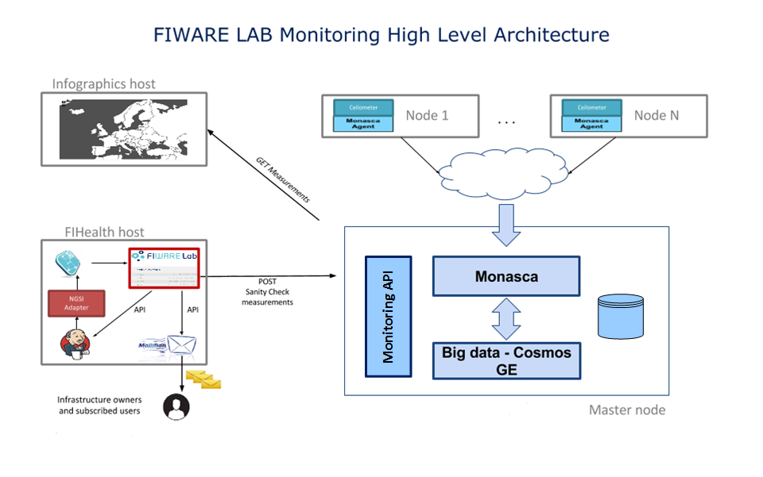

## Registering your Node in the Infographics 

The current FIWARE monitoring system is based on four stacked macro
components, some of them run on every FIWARE Lab node:

- **Ceilometer:**
  [*https://wiki.openstack.org/wiki/Ceilometer*](https://wiki.openstack.org/wiki/Ceilometer)

- **Ceilometer FIWARE plugin:**
  [*https://github.com/SmartInfrastructures/ceilometer-plugin-fiware*](https://github.com/SmartInfrastructures/ceilometer-plugin-fiware)

others run centrally on FIWARE Lab premises:

- **Monasca:**

  [*https://wiki.openstack.org/wiki/Monasca*](https://wiki.openstack.org/wiki/Monasca)

- **MonitoringAPI:**

  [*https://github.com/SmartInfrastructures/FIWARELab-monitoringAPI*](https://github.com/SmartInfrastructures/FIWARELab-monitoringAPI)

- **Infographic GUI:**

  [*https://github.com/SmartInfrastructures/fi-lab-infographics*](https://github.com/SmartInfrastructures/fi-lab-infographics)

Monitoring information collected by Ceilometer on each FIWARE Lab node
flows to the central Monasca API server for persistency, they are then
retrieved by the FIWARE Infographics GUI and FIWARE Lab Status page
using the FIWARE monitoring API that, in turn, provide aggregation and
authentication over the collected measurements.

In order to register a new FIWARE Lab node in the Infographic GUI some
required steps must be respected by Infrastructure Owner of the node and
must be successfully completed in the following order, as there are
dependencies:

1. Ceilometer must be installed and federated as explained in section
    [How to install a FIWARE Lab Node](4.installing.md#How_to_install_a_FIWARE_Lab_Node). 
    Moreover, it should be able to collect OpenStack default monitoring data locally.

1. Ceilometer FIWARE plugin must be properly installed and configured
    on the node. It should be able to push all the FIWARE custom
    measurements to the Monasca API server. Detailed and constantly
    updated instruction can be found on the GitHub repository under the
    branch that correspond with the running OpenStack version:
    [https://github.com/SmartInfrastructures/ceilometer-plugin-fiware](https://github.com/SmartInfrastructures/ceilometer-plugin-fiware).

1. Intention to publish the node on Infographic GUI must be notified
    during the FIWARE Lab node weekly meeting in order to enable the new
    node on a testing Infographic GUI. This allows to check that
    collected measurements are coherent with the real node status.

1.  Once the testing Infographic GUI reports correct data from the node,
    it will be published on the main GUI and the new FIWARE Lab node
    will be visible on both FIWARE Infographic and Status page GUI
    respectively at the following addresses:
    [http://infographic.lab.fiware.org](http://infographic.lab.fiware.org)
    and [http://status.lab.fiware.org](http://status.lab.fiware.org).
