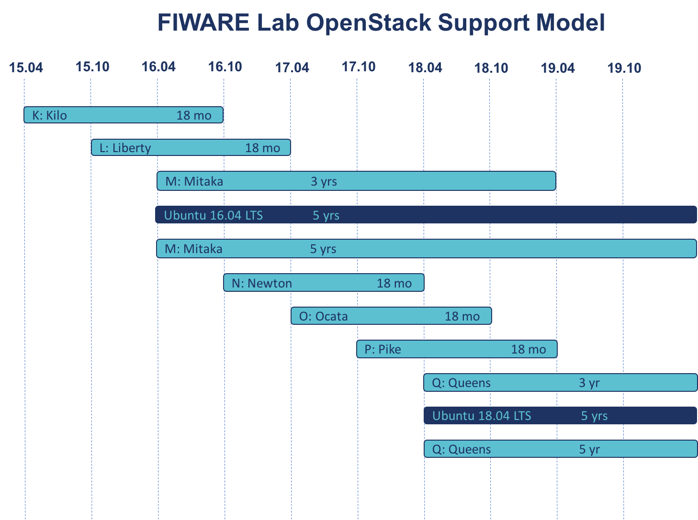

## OpenStack upgrade version policy in FIWARE Lab

FIWARE Lab nodes are based on OpenStack. OpenStack is developed and
released around 6-month cycle.

According to FIWARE Lab management rules the upgrade policy of a FIWARE
Lab node is two version behind the current official version under
development. This is to avoid unsupported-EOL OpenStack release,
security and performance issues. This policy secures us that we are
almost in line with the community. It is important to notice that the
upgrade of the OpenStack version can involve also the upgrade of the
Operative System. The recommendation of the FIWARE Lab is the use of
Ubuntu like Operating System. The next image shows as detail about the
FIWARE Lab policy in use:

More information about the release series of OpenStack can be found at
the following link: [https://releases.openstack.org](https://releases.openstack.org)

* **IMPORTANT**: A FIWARE Lab Node not updated, will stop working properly because
  not compatible with FIWARE Lab services!