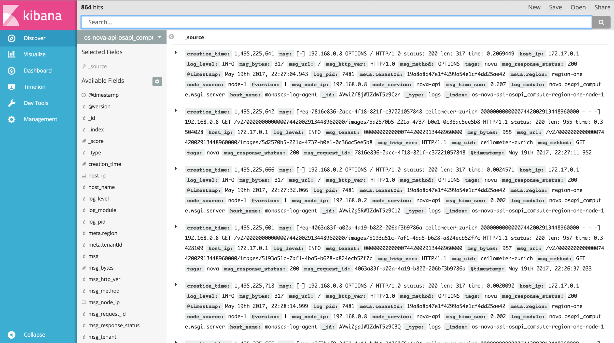

## Deep Log Inspection

Deep Log Inspection, if you completed the registration of your logs in
the FIWARE Lab service, allows you to analyse the logs. The service is
not yet in production, but it will be available soon at:
<https://kibana.deeplogmanager.lab.fiware.org>.

At this URL admins will be able to search in their logs any type of
issue or event (see interface) related to their node.

Beyond that a number of predefined queries and visualizations are
available to simplify admins routine analysis over the logs. You can
find a user manual at this link:
[*http://deep-log-inspection.readthedocs.io/en/latest/*](http://deep-log-inspection.readthedocs.io/en/latest/)
