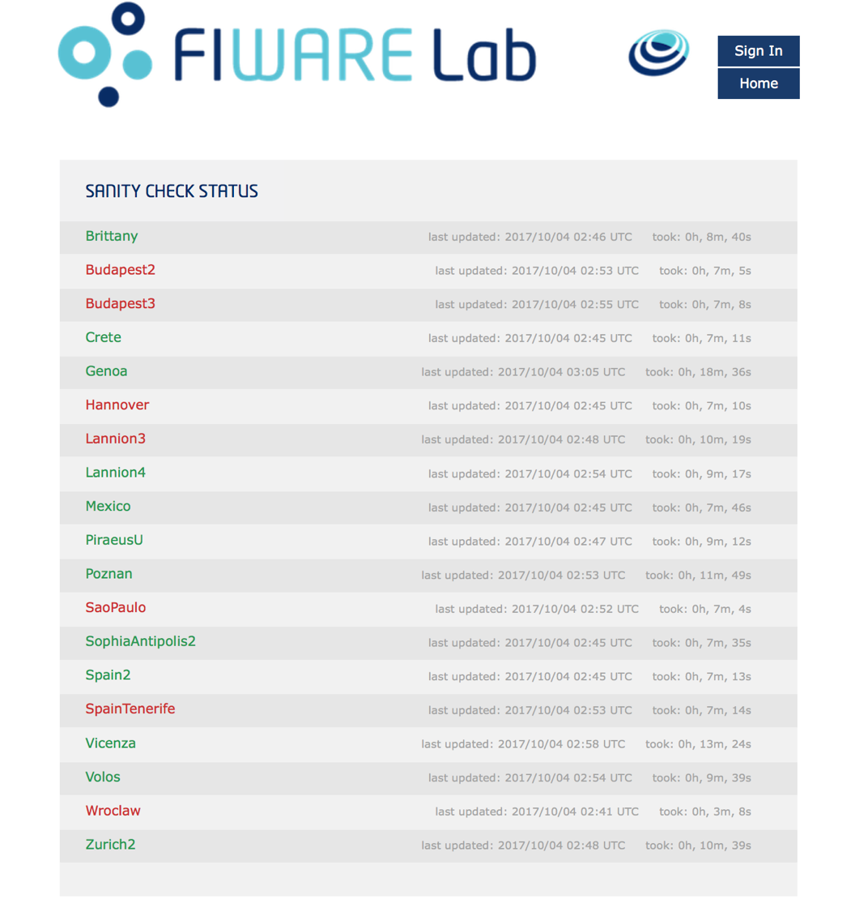

## FI-Health

FI-Health is an end-to-end testing tool that ensures that the OpenStack
integrated components are working as expected. Each of the FIWARE Lab
node is tested in a real-world scenario using OpenStack Rest APIs
provided by the federated Keystone service endpoints. The idea behind
these tests is to provide end-to-end testing of the FIWARE Cloud Portal
to test whether the flow of the application is performing as designed
from start to end. The purpose of carrying out these end-to-end tests
is to identify OpenStack services problems before or at the same time
that the users can observe those problems in the FIWARE Cloud Portal.
Therefore, FI-Health is the key component to provide Quality of Service
in the FIWARE Lab cloud environment.

You can obtain more information about the component by accessing the
[*FIWARE Health GitHub
repository*](https://github.com/telefonicaid/fiware-health/blob/develop/README.rst).
Note that if you want to increase or improve this tool you can suggest
new issues in this GitHub repository or even better provide us new PRs to extend
the functionality of the service.

Additionally, you can install and check this tool to check locally your
FIWARE Lab node. In that case, you should follow the indications in the
[*FIWARE Health Dashboard
readme*](https://github.com/telefonicaid/fiware-health/blob/develop/dashboard/README.rst)
and [*FIWARE Health Sanity Checks
readme*](https://github.com/telefonicaid/fiware-health/blob/develop/fiware-region-sanity-tests/README.rst).
