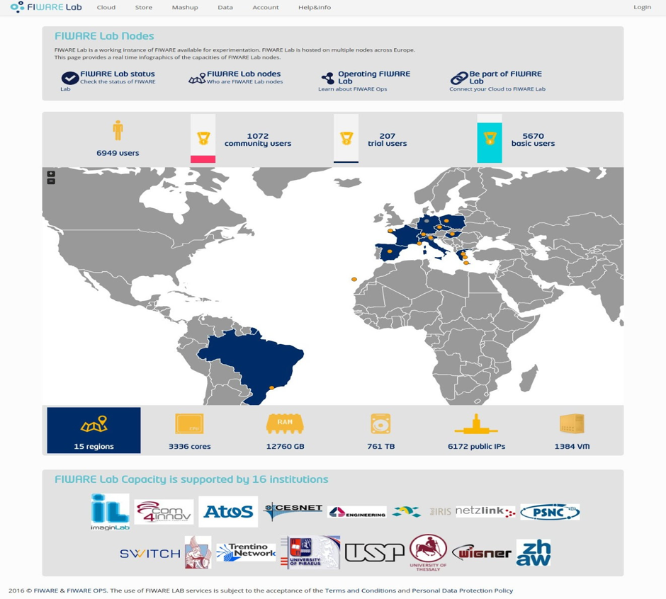
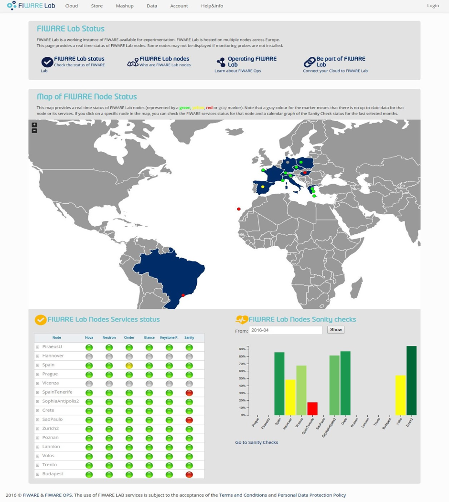

## FIWARE Lab Infographic

FIWARE Lab Infographics and Status Pages are simple but important
services to allow users to:

-   Know in an intuitive way the infrastructure capacities made
    available by FIWARE Lab infrastructure;

-   Monitor current status of infrastructure services and know about any
    issue in any node of FIWARE Lab infrastructure.

While the information on infrastructure capacities is more related to
marketing, the one on services status is extremely important to support
Developers and Federation Managers operations. The production URL of the
Infographics is the following:

-   <http://infographic.lab.fiware.org/>

-   <http://status.lab.fi-ware.org/>

This component provides capacity information about the different
OpenStack regions and status information of infrastructure services. The
Federation Monitor component exposes data on the capacity and status of
FIWARE Lab infrastructure through a set of RESTful API that Infographics
and Status Pages calls in order to get that data.

For more details, it is recommended to refer to the main documentation
included in the software repository:
<https://github.com/SmartInfrastructures/fi-lab-infographics>.

Figure below shows the main page of the Infographics tool. It is comprised
of:

-   a user’s section: it shows the total number of users as sum of Basic
    Users, Trial Users and Community Users;

-   a map that shows all nodes;

-   six interactive tabs that display different data;

-   the list of FIWARE Lab Capacity supporters;

When data about a specific node are obsolete, the node in the map is
grey and the user can check the timestamp of its last update by passing
the cursor over it.

The Status page depicted below is composed by:

-   a big map that shows all the nodes and their overall status (green,
    yellow or red);

-   a table showing the current status of all the FIWARE Lab nodes
    services together with the FIHealth Sanity Check status (FIHealth
    Sanity Check executes periodically a set of tests on the nodes in
    order to verify if the basic functionalities are guaranteed);

-   a histogram that shows the average on the last selected months of
    the Sanity Check status for each node.

