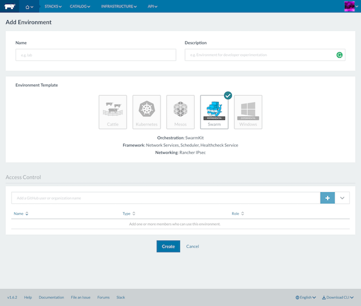

## Rancher

FIWARE Ops team has deployed a customised version of
[Rancher 1.6](https://rancher.com/docs/rancher/v1.6/en) on top of FIWARE Lab,
which can be found at [https://platform-manager.smartsdk.eu](https://platform-manager.smartsdk.eu).
This tool allows users with a Cloud account in FIWARE Lab to deploy and
manage a Docker Swarm cluster on FIWARE Lab. Through which they can
deploy their FIWARE applications on the Lab using docker containers.
This is a service offered to the users, and as such FIWARE Lab Node
Administrators do not have much to do. They only need to be sure that:

-   Their OpenStack APIs are reachable from FIWARE Lab servers (which
    should be the default case).

-   Provide the configuration of the MTU they set within their FIWARE Lab nodes
    to the users interested in using the service (or even installing manually
    Docker Swarm). The MTU values can vary, depending on the OpenStack
    installation, so it's advised to refer to the [OpenStack documentation](https://docs.openstack.org/rocky/)
    for more details if needed.

