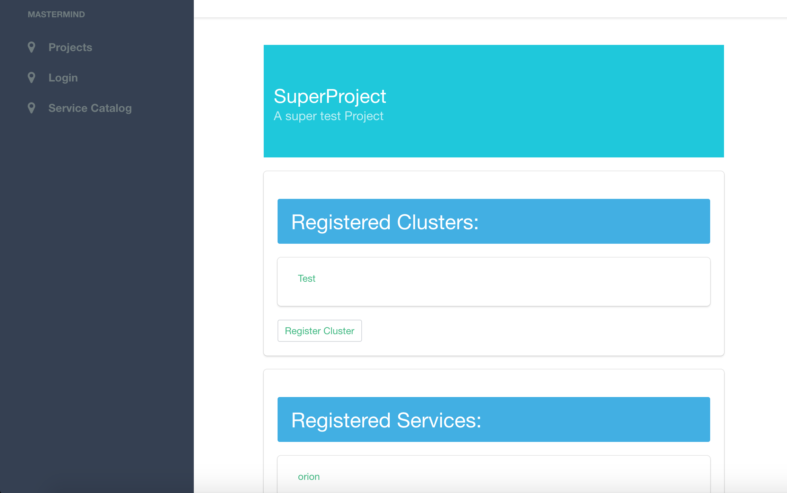

## FIWARE Mastermind

MasterMind is an ongoing development effort to provide a solution to
easily configure and orchestrate FIWARE NGSI-based services. The service
is provided to FIWARE Lab end-users as a centralised service. No
specific action is needed by single FIWARE Lab Node Administrators.
Currently the service in under development, so it is not yet deployed in
FIWARE Lab. Current status can be found at:
[*https://github.com/martel-innovate/MasterMind-API*](https://github.com/martel-innovate/MasterMind-API)

The following is a screenshot of the Work in Progress MasterMind UI.

