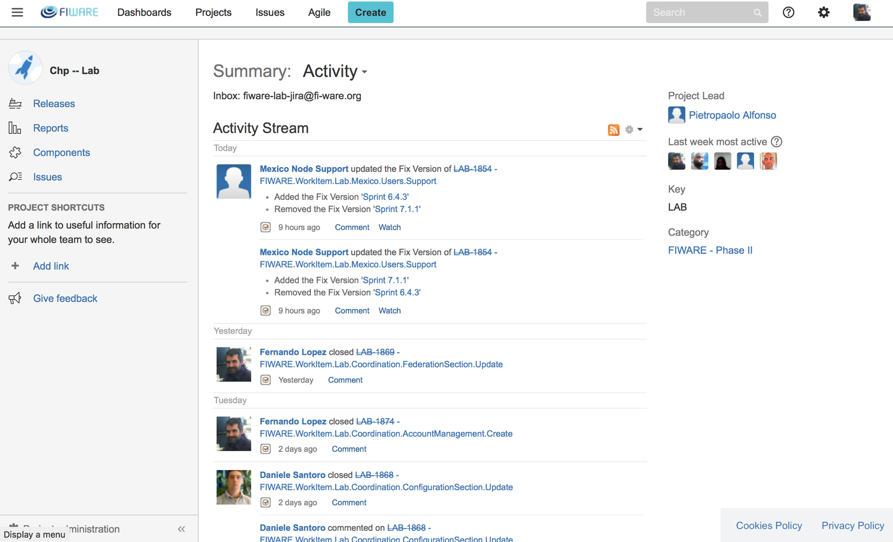

## JIRA

Jira is the ticket manager tool used from internal and external users.

The main internal usage of Jira is to keep track of all activities
carried out within FIWARE Lab and to assign specific tasks to the
different stakeholders. Jira, combined to Agile dynamics, is used to
create monthly Sprint useful to plan upcoming tasks as well as to fix
and reach targets.

The following is a picture of Jira which is available at
[https://jira.fiware.org](https://jira.fiware.org)

