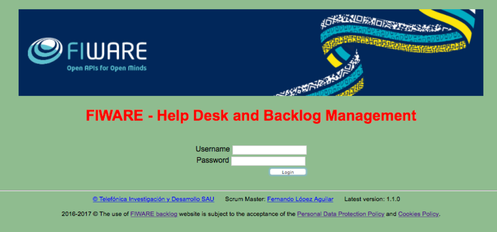
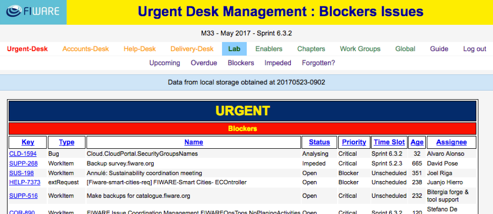
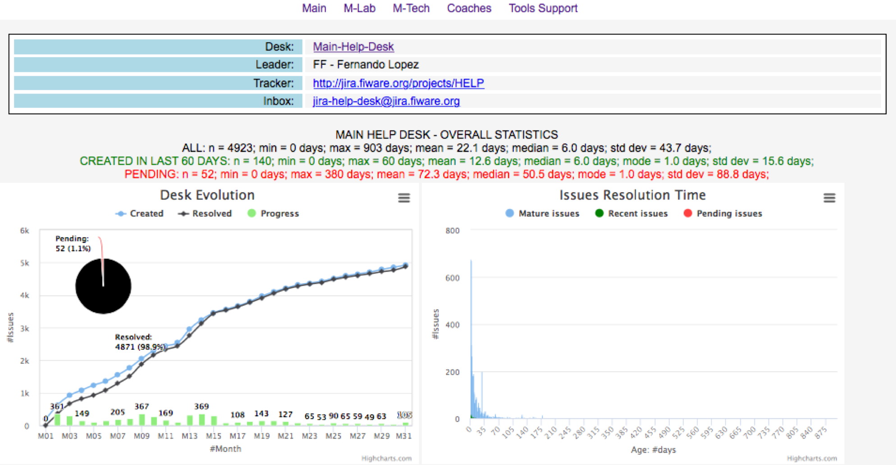

## Backlog

The backlog management web site is a tool implemented with the purpose
to provide easy understanding of the activity recorded on the trackers.
Access to FIWARE Backlog Management Web Site at
[*http://backlog.fiware.org*](http://backlog.fiware.org)

At FIWARE we are looking to be sensitive to several sources demanding
both reactive and proactive working modes. Therefore, the Backlog
Management web site has been arranged accordingly.

Important thing in the Backlog tool is the Urgent Desk and Help Desk
option in the menu. The Urgent Desk is an important tool since it allows
to create common awareness on issues with time-sensitive fields such as
issues’ deadlines, priorities and status. To meet this objective, it
collects all items in the trackers with relevant deadlines, priorities
and status to display them in the desk. Additionally, the Help Desk is
also a key tool in supporting the end users. It is implemented by adding
email lists connected to JIRA. The Backlog Web Site also helps by
providing meaningful views for the different channels and actors.

Last but not least, each channel has its corresponding view in the
tracker and backlog web site. Two key channels from the technical point
of view are:

-   fiware-lab-help help desk view of the channel devoted to incoming
    issues to be solved in FIWARE Lab.

-   fiware-tech-help help desk view of the channel devoted to incoming
    issues to be solved in Generic Enabler Implementations.

Both channels are analysed every day by the L1 HELP-Desk support team in
order to assign correctly the tickets that we receive to the owners and
resolve it in time in order to complete the requirements of the FIWARE
Lab node SLA levels.
