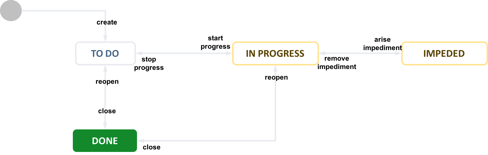
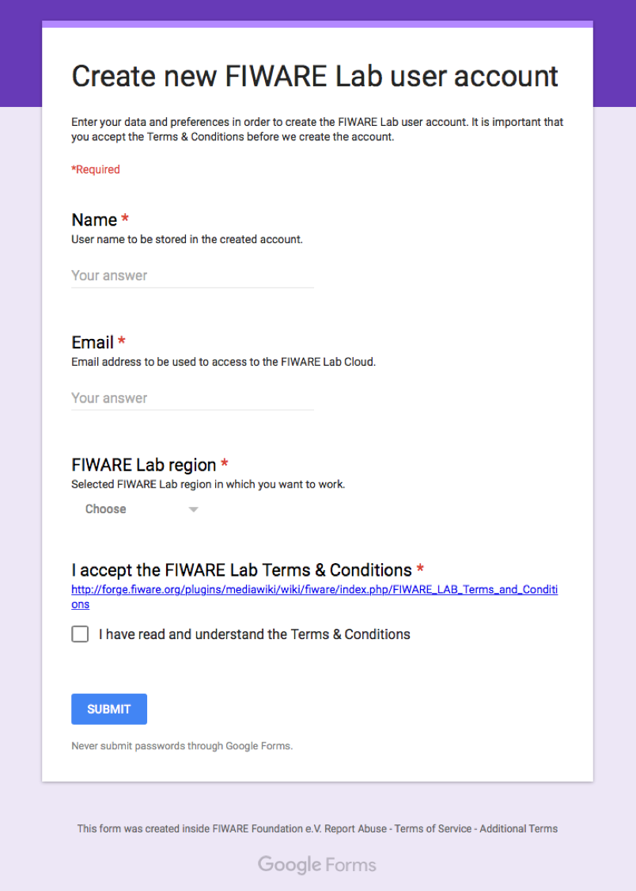
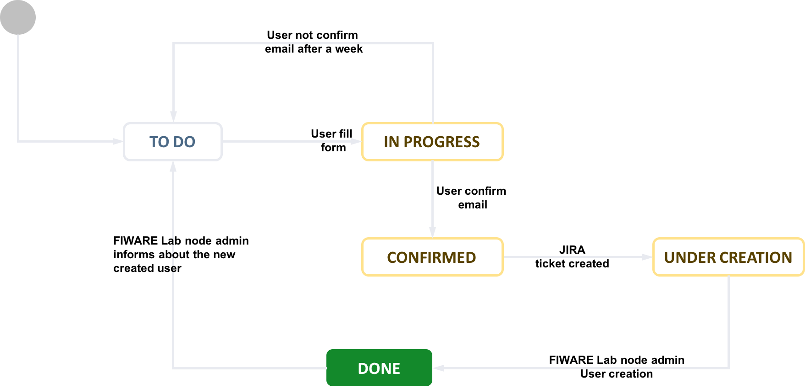
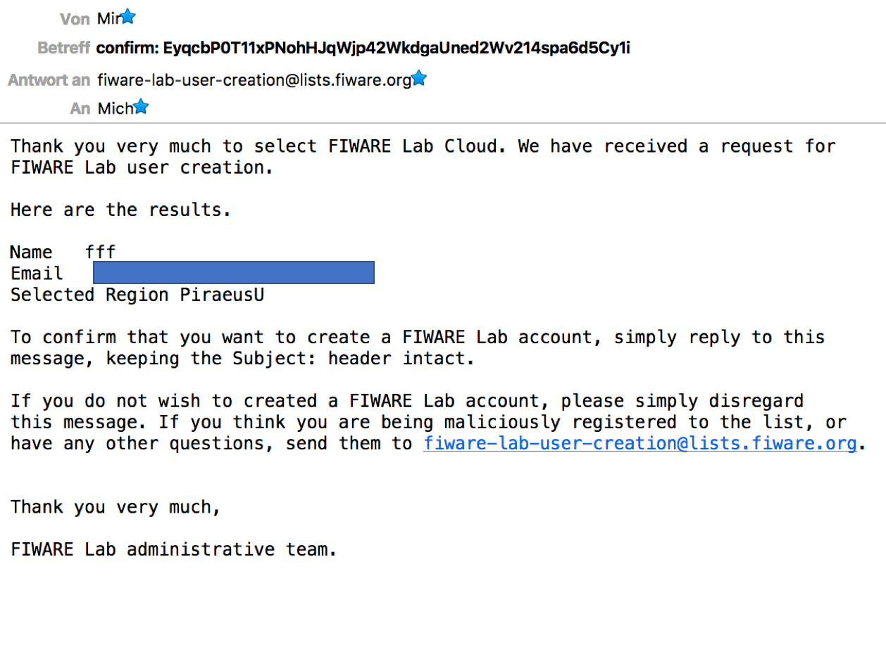

## Account Management

This section contains the different actions to manage a user account.
The most important issue relating to customer accounts is the process to
upgrade from a FIWARE Trial Account to a FIWARE Community Account, what
are their available resources, how can apply and so on and what have to
do every FIWARE Lab node administrator to proceed with it.

### Request for Community Account Upgrade

To request an account upgrade, FIWARE Lab users need to fill in an
Upgrade Account request.

-   Who can apply?

    Participants to the FIWARE Accelerator programme

    Individuals and Companies willing to develop innovative applications
    based on FIWARE, and to disclose the usage of FIWARE they will make.

-   How much does it cost?

    It's free! We are enacting this requirement to ensure that start-ups
    and SMEs willing to develop applications and demonstrators using
    FIWARE have the access to the proper resources.

-   How long do I retain the Community Status?

    The typical duration for the community status is 9 months. We believe
    this is enough to allow a team to develop a complete solution based on
    FIWARE. If needed, accounts can be extended. A procedure will be made
    available in due time.

-   How can I request for a Community Account upgrade?

    Users can apply through the [help page](http://help.lab.fi-ware.org)
    clicking on the “Request Community Account upgrade” button.

-   How much should it take to complete the procedure?

    The support team is available 9 am to 5 pm during working days. Except
    for complex request where negotiation of resources is required, a
    request should be fulfilled in 1 working day.

### Quotas and Flavours

#### What is a Flavour and what are the available flavours?

Flavours represents the size of virtual machines. FIWARE Lab flavours
are based on OpenStack flavours. Available flavours in the FIWARE Lab
are listed in this table.

| **ID** | **Flavour** | **Memory** | **Disk** | **Virtual CPUs** |
| --- | --- | --- | --- | --- |
| 1 | m1.tiny | 512 | 1 | 1 |
| 2 | m1.small | 2048 | 20 | 1 |
| 3 | m1.medium | 4096 | 40 | 2 |
| 4 | m1.large | 8192 | 80 | 4 |

Keep in mind that it is only a recommendation to optimize the physical
resources available in a node. Each of the FIWARE Lab administrators is
free to create new flavour or change resources assigned to users but in
that case, they could break the homogeneity between different FIWARE Lab
nodes and could be difficult (if not impossible in some cases) to make a
migration from one node to another.

#### What are the default quotas?

By default, each user has assigned a minimum number of resources that
can be used in the development of its solution. This quota is comprised
of the following values:

| **VM Instances** | **vCPUs** | **Hard Disk** | **Memory** | **Public IPs** |    **Routers** | **Networks** |
| --- | --- | --- | --- | --- | --- | --- |
| 2 | 2 | 40 Gb | 4096 Mb | 1 | 0 | 0 |

#### What are the default maximum quotas?

If the project required more resources, the users have the possibility
to explain it and the default quotas can be extended to a maximum
default quotas that is comprised of the following values:

| **VM Instances** | **vCPUs** | **Hard Disk** | **Memory** | **Public IPs** |    **Routers** | **Networks** |
| --- | --- | --- | --- | --- | --- | --- |
| 5  | 10 | 100 Gb | 10240 Mb | 1 | 1 | 1 |

Keep in mind that in order that users can obtain more resources, it is
mandatory that they provide the corresponding justification why they
need more resources. Exceptionally, if users need more resources, after
a clear justification the FIWARE Lab nodes can provide extra resources
to cover them.

### Resource assignment and account upgrade by FIWARE Lab administrators

This section describes how FIWARE Lab Node operators should process
incoming requests. The process is simple and depicted below.

Once, for example, a coach assigns you a ticket, you start progressing
it, each comment will be notified to the end-user that will be in this
way able to provide you further information. For resource
assignment/negotiation the guide in Section [Quotas and Flavours]()
should be considered.

If your node is not able to complete the assignment, we suggest
negotiating the assignment of those resources in other FIWARE Lab node,
taking into consideration user’s requirements and predefined
accelerator's program to FIWARE Lab nodes mapping. Of course, you should
inform users about this migration assignment to confirm that it is ok
for them.

#### How to assign resources to a new community user

To manage user information, you have to use the Horizon-based Cloud
Portal interface at
[*https://cloud.lab.fiware.org*](https://cloud.lab.fiware.org). In this
web site, you can to click on the button *Request Community Account* and
you will see a dialog box requesting the information required to set up
a community account. Once the user has filled all the information and
submitted it, the process will start with the creation of the
corresponding Jira ticket. The next steps that every FIWARE Lab node has
to follow is the following:

1.  Start progressing the ticket as soon as you receive it.

1.  Check the requested resources and comment to inform the user about
decision on resources, or additional information you need.

1.  If the user is not created you have to create it.

1.  If the user doesn’t have an associated project to create cloud
resources, you have to create it and to assign the user as a member
of the project.

1.  Assign the role *Community* in the domain *default* to the user. The
user can have several roles for different projects (owner, member,
...), however, it is a Community or a Trial user for the
whole domain.

1.  Include in the metadata of the user (*description* field) the date
in which the user has been upgraded to Community (with the format
`"community_started_at": "YYYY-MM-DD"`).

1.  Assign the desired quotas in your node to the user

1.  Assign the endpoint group of your node to the user’s project.

1.  If you need to contact the user you can use the email address
included in the user detail.

1. Progress to “done” when completed.

1. Alternatively, if any impediment arises, move to impeded, and inform
the user by commenting the ticket.

### Procedure to create new FIWARE Lab user account

The process to create a new FIWARE Lab user account, includes a
procedure to check that the email introduced is a valid email. During
this process, FIWARE requested the information to the user to be
completed in a Google Form. This information includes:

-   User name to be kept in the database.

-   User email to communicate any issue directly to the user.

-   Preferred FIWARE Lab regions to be used.

-   Acceptance of the FIWARE Lab Terms & Conditions.

All these data are mandatory to be fulfilled. This form activates a
specific procedure to manage the creation of the FIWARE Lab user
account.

Once that the user submits this information an email will automatically
be sent to the user using the email provided. This email includes in the
subject (Betreff in German in the following picture) the confirmation
code to be submitted. The user must reply to this email in order to
confirm that the email is correct.

During this procedure, it is requested to the new user the confirmation
to create a new user. This confirmation is obtained through the response
of this received email leaving intact the Subject or the email. The
received responded email with the Subject intact is enough to confirm
and activate the JIRA ticket creation with the corresponding FIWARE Lab
node administrator in order to create the corresponding user account.
After the creation, the FIWARE Lab node administrator informs the users
that the new account has been created and the recommendation to change
the password by themselves.

The information of the user created (and eventually deleted) will be
kept under Data Protection control for statistical purposes and
evaluation of the creation and deletion of user accounts in the FIWARE
Lab ecosystem.
