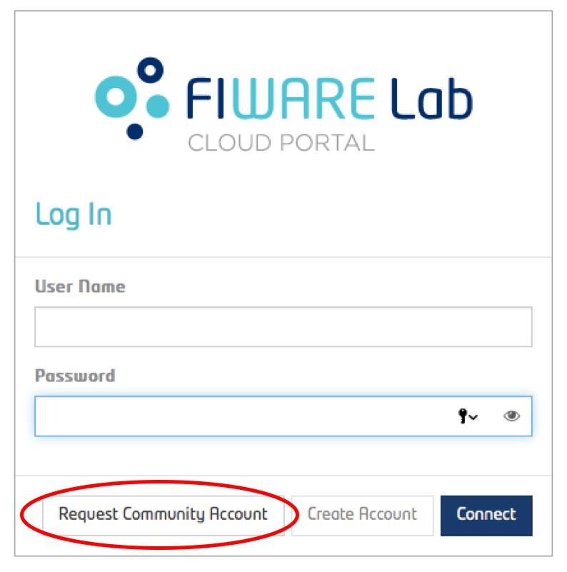
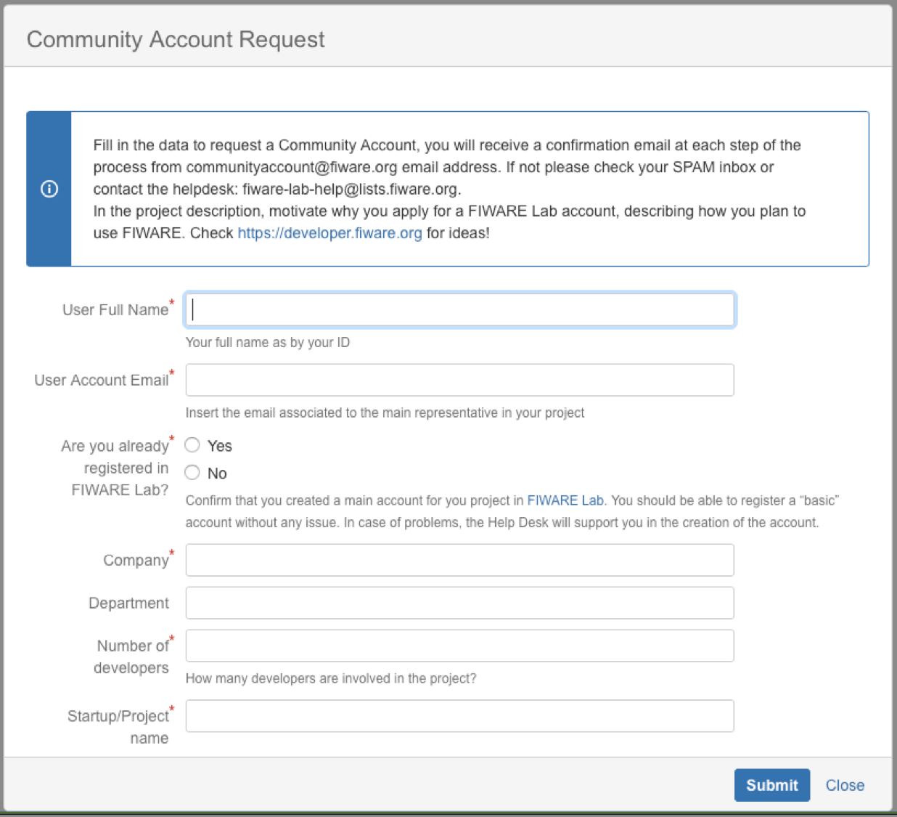
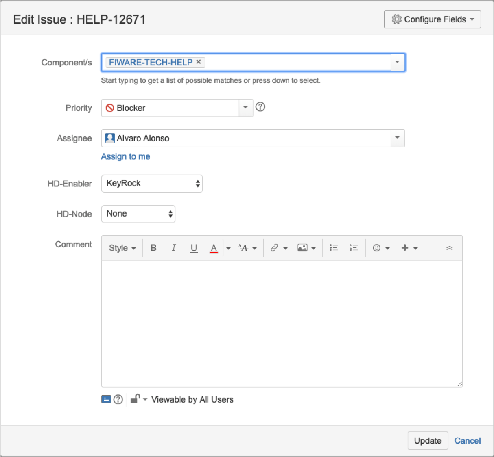
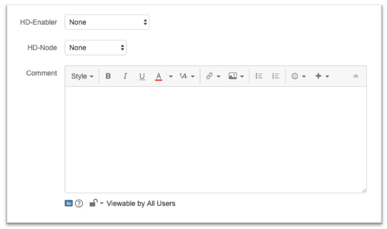

## Coordination and support procedures

### Coordination Approach

FIWARE Lab activities are managed by bi-weekly meetings on Tuesday 15:00 CET,
all FIWARE Lab nodes administrators are invited to participate on it and share
their status and discuss different topics relating to the activities carried out
within the FIWARE Lab.

The main topics covered within the meeting are:

-   Status of the node

    Each Node Administrator, provides a snapshot of the current status of
    its node. He/She provides information about the presence within the
    [Infographic page](http://infographic.lab.fiware.org), about the
    [Sanity Checks status](http://status.lab.fiware.org), as well as
    useful updates during specific activities like hardware maintenance,
    users migration or OpenStack upgrade version.

-   Issues occurred during the previous week

    Each Node Administrator, discusses issues encountered during the past
    week. This is a crucial point in order to identify and solve possible
    weaknesses or bugs within the FIWARE Lab architecture (e.g. common
    connectivity errors toward the centralized keystone) as well as
    possible weakness in the FIWARE Lab documentation.

-   Instructions from the FIWARE Technical Steering Committee

    This task is to inform all Nodes Administrators about decisions taken
    by the FIWARE Technical Steering Committee and to design a roadmap of the
    future activities.

-   Help Desk pending requests

    All Nodes Administrators are asked to verify all pending (not closed)
    Help Desk requests, and it is discussed how to resolve them as soon as
    possible in order to meet agreed SLAs.

-   Share suggestions

    This task is to share suggestions among all Node Administrators and
    FIWARE Lab technical experts. It is an important aspect of the meeting
    because it allows those who have found a solution or workaround for a
    specific problem to share that experience among the community to
    facilitate the expansion and stability of FIWARE Lab.

-   Topics of the day

    This is an open window within the meeting to discuss about topics
    (even off-topics) not covered during a standard meeting.

Beside all points above, a specific mailing list
(fiware-lab-federation-nodes@lists.fiware.org) is used by FIWARE Lab node
administrators and FIWARE Lab experts to exchange each other
doubts, information, tips and any kind of communication useful to the
growth and stability of FIWARE Lab.

### Community Account Requests

A Community User is allowed to experiment with FIWARE technology for a
period of more than 9 months. Typical examples are SMEs/start-ups under
the FIWARE Accelerator Programme.

Trial Users can always apply to for upgrading their accounts to become
Community Users. This is granted to everybody if it is understood that
the application they aim to developing, is considered a relevant
reference example for the development of the FIWARE Community.

In order to apply to become a Community User it is necessary to compile
an application form accessible through the main page of the FIWARE Lab
portal [FIWARE Lab portal](https://account.lab.fiware.org) - click
the *Request Community Account Upgrade* - button.

This will open a window in which information about application is
requested from the user, this information will be used to understand
exactly what is the planned use of the resources, why they are required
and in which FIWARE Lab node you plan to use those resources.

It will create a ticket inside the FIWARE Lab Upgrade Account in Jira to
be response by the L1 Support team and assigned accordingly to the
corresponding FIWARE Lab administrator node in order to resolve it.

From here, the FIWARE Lab node administrators will take those tickets
and apply the corresponding activities described in
[Account Management](/docs/5.management/1.account.md) to provide the
corresponding resources to the user.

### Help Desk Support

The Help Desk activities are daily part of FIWARE Lab operations. The
Help Desk is the support that FIWARE Lab experts, Nodes Administrators
and GEs Owners, give to external and internal users. The Help Desk
activities are structured in 2 main Level of support in order to
guarantee that agreed SLAs are achieved.

The first level of support is comprised of a team which is in charge of
managing all FIWARE Lab incoming tickets. This team is also responsible
for categorizing all incoming tickets in order to guarantee that proper BA
process can be executed to extract relevant information about the use of the
different FIWARE GEs.

In the following, we describe in more details the procedures for Level 1
support.

The Level 1 Help Desk team is organized in 8x5 (Monday to Friday) scheduled
shifts from 08:00 to 17:00. The team is composed by people from the
FIWARE Foundation. It provides support for general issues that can be easily
solved by pointing to the FAQ, Stack Overflow, groups or other
documentation. Moreover, its responsibility is to filter, categorise and
forward to Level 2 support (Node Owners or GE Owners) all those tickets
that it is not able to answer. It is also responsible for managing
Community Account requests.

At the end of each day, there should be no tickets remaining in status
“unassigned” within the FIWARE Lab Help Desk queue:
[*http://backlog.fiware.org/lab/helpdesk*](http://backlog.fiware.org/lab/helpdesk).

#### Level1 Support Requests Management

The activity that each member of the L1 Support Team should be assigned
the corresponding tickets to the proper person, assigning the
corresponding Component and for statistical reasons assign the
corresponding HD-Enabler or HD-Node. They are Jira issues
attributes that need to be assigned manually when a new ticket is
received.

For the assignee of the JIRA ticket, we have to differentiate between
Generic Enablers owners and FIWARE Lab administrators’ nodes. For the
first one, the list of owners can be obtained from the following table:

[*FIWARE GE owners*](https://docs.google.com/spreadsheets/d/1X9iLY9Znd3Rh-GM4qffGEHRNKqKcHZqdm-dP0rq8OVo/edit#gid=694707434)

It is a working document of FIWARE and it is available for the FIWARE
Lab administrators. If a FIWARE Lab node administrators want to get
access to it, they can request access to the owner of the file (fernando
dot lopez at fiware dot org). Regarding the list of FIWARE Lab node
administrators, the list can be obtained in the following file:

[*FIWARE Lab node administrators*](https://docs.google.com/spreadsheets/d/1X9iLY9Znd3Rh-GM4qffGEHRNKqKcHZqdm-dP0rq8OVo/edit#gid=744561338)

Regarding the components, usually they are automatically selected by the
different tools that are behind JIRA, but in case that we found a JIRA
ticket without the component the available values are the following:

| **Components** | **Description** |
| -- | -- |
| FIWARE-COLLABORATION-REQ | Issues related to the request associated to some type of collaboration with FIWARE in terms of participation in some events or in terms of improvements of some FIWARE GE |
| FIWARE-FEEDBACK | General issues related to feedback recover from the users. |
| FIWARE-GENERAL-HELP | Issues in general not classified in the other components. |
| FIWARE-LAB-HELP | Issues related to some of the FIWARE Lab nodes |
| FIWARE-MUNDUS-REQ | Issues regarding the activities of FIWARE associated to the extension of FIWARE beyond Europe (FI-GLOBAL project). |
| FIWARE-OPEN-DATA-REQ | (Deprecated) Issues related to the management of Open Data inside CKAN tool or related to the possibility to contribute with Open Data inside FIWARE ecosystem. |
| FIWARE-OPS-HELP | Issues related to the use of the different FIWARE Ops tools.
| FIWARE-SMART-CITIES-REQ | (Deprecated) Issues related to the collaboration in the SmartCities |
| FIWARE-SPEAKERS-REQ | Issues related to the request to get some FIWARE expert to provide some presentation or speech in some events or just in some Summer School or so on. |
| FIWARE-TECH-HELP | Issues related to some of the FIWARE GE. |
| FIWARE-TRAINING-REQ | (Deprecated) Issues related to the request of training for some of the accelerator program. Currently, it is not needed due to there is no request for training from accelerator programs. |

In case of HD-Enabler, it makes reference to the
corresponding Enabler to which the corresponding JIRA ticket has to be assigned
to, the way it was described previously. It is something that have to be
selected once we edit the corresponding JIRA issue.

Last but not least, HD-Node makes reference to the corresponding FIWARE
Lab node in which this issue should be resolved. Usually, the issues are
related to FIWARE GEis or FIWARE Lab nodes. The first one is associated
to the email <fiware-tech-help@lists.fiware.org> and the second is
associated to <fiware-lab-help@lists.fiware.org>. This means:

-   FIWARE GEs have associated the attribute of the HD-Enabler in order
    to identity which one is it.

-   FIWARE Lab nodes has associated the attribute HD-Node, in order to
    know to which FIWARE Lab node is assigned this issue or Jira ticket.

-   Due to these tickets come from different source it is needed to
    complete only HD-Enabler in case of tickets associated to FIWARE GEs or
    HD-Node is case of tickets associated to FIWARE Lab nodes.

How it was mentioned before, the reason of it, is just to allow further
analytical analysis of the tickets that we receive in the different
channels.

#### Community Account Requests Management

The Level 1 team is also responsible for the process of approval of the
Community Account requests.

Each time a FIWARE Lab user asks for a Community Account, a “FLUA”
ticket is generated and the Level 1 team is responsible for verifying
the eligibility of users and approve the requests of the user as
trusted.

This is done by examining the scope of the account request, e.g. the
project for which it was requested and how it adopts FIWARE
technologies. To be eligible, a request should: i) make relevant use of
key FIWARE technologies (i.e. not just using the Lab as mean to host
other technologies); ii) have an experimentation or educational purpose
(i.e. commercial services cannot be hosted on FIWARE Lab).

Only if an account is eligible, the user is upgraded to Community and the
resources assigned accordingly.

Based on the preferences of the user and resource available, the Level 1
team assigns the approved accounts to a Node. The Level 1 team will keep
open the initial ticket until the node completes the assignment and
eventually follows up with the assigned node (and the user) to ensure
that the procedure completes correctly.
