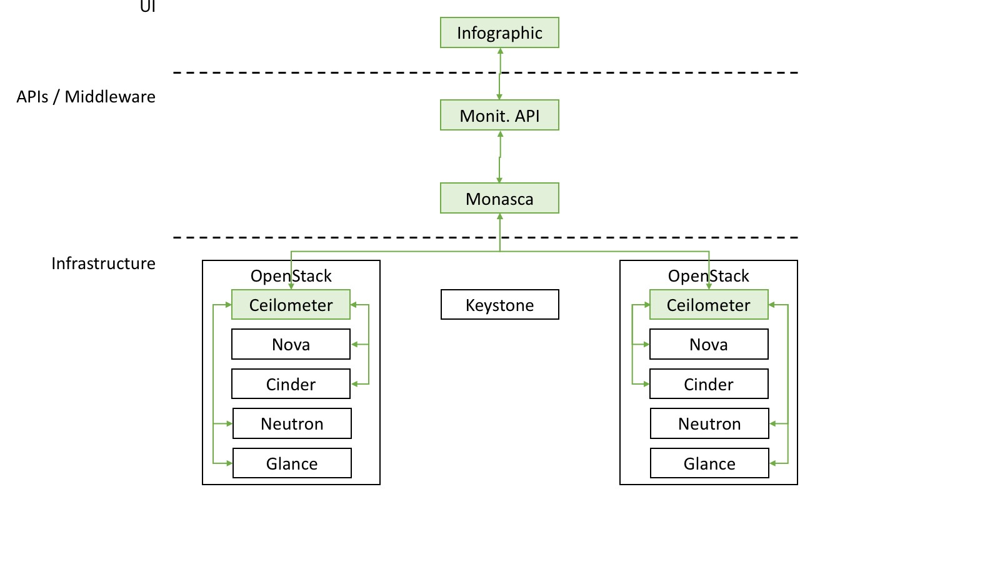
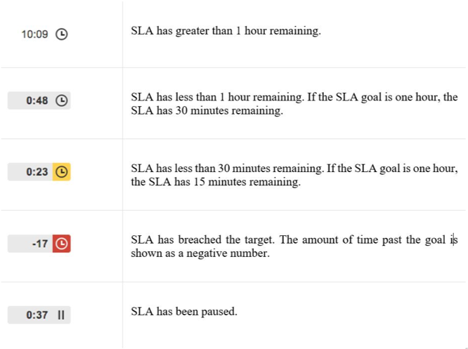
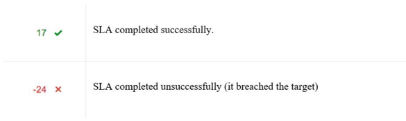

## Procedure to monitor SLA

### Services availability SLA Monitoring

FIWARE Lab node services are the set of OpenStack services that are
running on each of the FIWARE Lab nodes. The measurement of availability
of those services is managed through the use of the FIWARE Lab
monitoring system tool. This tool collects all the monitoring measurements 
from each FIWARE Lab node. This information is centrally stored, aggregated 
and available through the FIWARE monitoring API for both real-time raw data 
and aggregated historical data.



FIWARE relies on the above pipeline to calculate the FIWARE Lab node
overall service availability analysing the uptime status of:

1.  The OpenStack services (Computing, Networking, Storage and
    Authentication) using the [*Monasca agent component installed on
    each FIWARE Lab
    node*](https://github.com/SmartInfrastructures/ceilometer-plugin-fiware#monasca-agent)

2.  The FIWARE Lab node Sanity Check using [*FIWARE Lab
    Health*](https://fi-health.lab.fiware.org/)

In particular the monthly averaged uptime of such services is stored in
the historical monitoring database as a unique OverallStatus metric and
its value should not be lower than *95%*, in order to respect the given
SLA. To retrieve the aforementioned monthly uptime, a specific FIWARE
monitoring API (Services4Region) is used:

In order to get aggregated and averaged information, a specific
monitoring API (Services4Region) will be used:

<http://docs.federationmonitoring.apiary.io/#reference/service/services4region/list-all-services-running-on-a-given-region>.

An example of SLA check performed on day 2017-11-01 and considering the
services availability of October follows:

1)  ``curl http://HOST:PORT/monitoring/regions/REGION_ID/services?since=2017-10-01&aggregate=m``

2)  A JSON summarizing the daily uptime status of each service will be
    downloaded

3)  The field OverallStatus will be considered for the SLA check:

    ```json
    {
      "value": "yellow",
      "value_clean": 0.6789216470588236,
      "description": "description"
    }
    ```

4)  Should be this number below 95% over the last SLA monitoring period
    (a month considered in the example), it will be considered a
    violation.

Of course, each FIWARE Lab node responsible could check its own
availability using the aforementioned API and aggregating historical
data by hours, day and month.

### Help-Desk tickets handling SLA Monitoring

As we have mentioned previously, the Help-Desk tickets are managed
through a JIRA instance. This allows us to maintain control and operate
a ticketing system to monitor the evolution of tickets with the
possibility to fix resolution times and service policies. In summary,
Jira is our single point of contact between FIWARE Lab service providers
and the FIWARE Lab users. It is the typical definition of a Service Desk
which manages incidents and service requests in the same way that it
handles communication with the users. JIRA can offer a plugin called
[JIRA Service Desk](https://www.atlassian.com/software/jira/service-desk)
to provide a fully featured service desk with self-service, automation,
SLAs, and Customer Satisfaction (CSAT) reporting. More important for our
purposes is that Jira Service Desk provides built-in Service Level
Agreement (or SLA) management. It is a time metric, which lets you
define how time will be measured for this SLA; and, last but not least,
a goal for selected issues, which lets you define a target for the time
metric. Different sets of issues can have different goals.


While the time conditions on an SLA specify what your team considers to
be trackable time, the goal section of the SLA metric lets you set the
amount of time that's allowed for different scenarios.


We can define SLA Calendars in order to specify team's working hours.
For example, SLA calendars let you exclude night-time, holidays, or
weekends from the time that affects the SLA metrics. It is important to
take into account that for computing the SLA we exclude the weekend
days.

Once that the SLA is configured by the Jira administrators, team members
can see a read-only version of the SLA tab so they can view how the SLA
is configured. In the detailed view, the SLA section lists even more
detail about the SLA that the issue is being measured against.


The SLA tracker uses colours to indicate the urgency of a given SLA for
an issue based on the time remaining. In the following figure, you can
see the description of the colours that are offered by the JIRA Service
Desk.



A completed SLA displays the time remaining when the SLA was completed
(or the amount of time breached) and an icon to indicate whether the SLA
was completed successfully or unsuccessfully.



As an overall result, we can access this information through JIRA API
and in that case, we can, through a script, compute the number of
tickets in progress by the end of the day and evaluate if it is below
95% over the SLA monitoring period, which will be considered a
violation.

As regards ticket resolution, the operation will be the same. A script
computes the resolution time for each ticket assigned to a node over the
SLA monitoring period, and compute the number of tickets that are closed
within 48 hours (the script will consider properly also weekends or
holidays), should be this number below 95% over the last SLA monitoring
period, it will be considered a violation.

